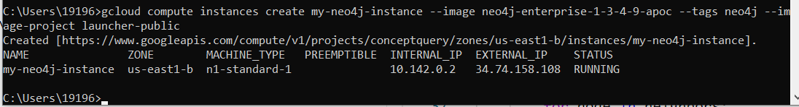

# Database

## DynamoDB

Store data for web crawler and text parsing (e.g., entity patterns). Python interface using boto3.

To create local DynamoDB instance:
- Install Java: https://www.maketecheasier.com/run-java-program-from-command-prompt/
- Follow instructions: https://www.dynamodbguide.com/environment-setup

Navigate to ```dynamo_db``` directory (location may vary), then:

```
java -Djava.library.path=./DynamoDBLocal_lib -jar DynamoDBLocal.jar -sharedDb -port 5000
```

Note: you may need to set the PATH variable to enable java from command line (Windows)

## Neo4j

Store concept graph. Python interface using py2neo.

```
graph = Graph('bolt://localhost:7687', password='pswd')
```

https://medium.com/neo4j/neo4j-get-off-the-ground-in-30min-or-less-3a226a0d48b1

https://neo4j.com/blog/building-python-web-application-using-flask-neo4j/
http://nicolewhite.github.io/neo4j-flask/pages/the-data-model.html

### Google Cloud

https://neo4j.com/developer/neo4j-cloud-google-image/

Google Cloud SDK installation:

Windows: https://cloud.google.com/sdk/docs/quickstart-windows

* Commands that require authentication will use agongt408@gmail.com by default
* Commands will reference project `conceptquery` by default
* Compute Engine commands will use region `us-east1` by default
* Compute Engine commands will use zone `us-east1-b` by default

Create firewall rule:

```
gcloud compute firewall-rules create allow-neo4j-bolt-https --allow tcp:7473,tcp:7687 --source-ranges 0.0.0.0/0 --target-tags neo4j
```

Google Instance types:

https://cloud.google.com/compute/docs/machine-types

Default: n1-standard-1 (1 vCPU, 3.75 GB)

Create a Google Compute Instance from the Neo4j Public Image:

```
gcloud config set project my-project-id
gcloud compute instances create my-neo4j-instance \
    --image neo4j-enterprise-1-3-4-9-apoc \
    --tags neo4j \
    --image-project launcher-public
```



External IP: 34.74.158.108

Access neo4j web browser:

https://[External_IP]:7473

Username: neo4j
New Password: password

